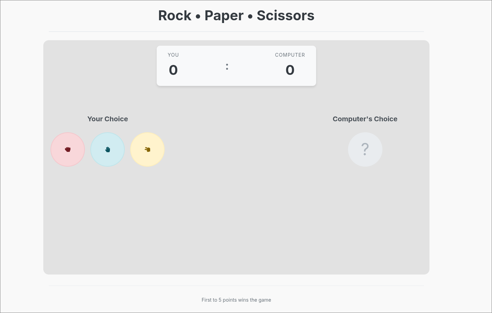

# Rock Paper Scissors

[DEMO](https://rock-paper-scissors-game-znag.vercel.app/)

A modern implementation of the classic Rock Paper Scissors game built with React and TypeScript.

## Table of Contents

- [Features](#features)
- [Tech Stack](#tech-stack)
- [Installation](#installation)
- [Quick Start](#quick-start)
- [Available Scripts](#available-scripts)
- [Testing](#testing)
- [Project Structure](#project-structure)



## Features

- Interactive gameplay with animations
- Score tracking
- Responsive design for all devices
- Gesture icons with visual feedback
- Game over screen with results
- Accessible design with keyboard navigation and ARIA attributes
- Unit tests for game logic using Vitest
- Follows SOLID principles

## Tech Stack

- **React 19**: Functional components and hooks
- **TypeScript**: Strict mode enabled for type safety
- **Vite**: For fast development and optimized builds
- **SCSS Modules**: For component-scoped styling with advanced features
- **React Icons**: For gesture icons
- **Vitest + Testing Library**: For unit testing
- **ESLint + Prettier**: For code quality
- **Husky + lint-staged**: For pre-commit hooks

## Installation

### Prerequisites

- Node.js (v18 or newer)
- npm or yarn

### Setup

1. Clone the repository:

```bash
git clone https://github.com/sasholk/rock-paper-scissors-game.git
cd rock-paper-scissors-game
```

2. Install dependencies:

```bash
npm install
# or
yarn install
```

## Quick Start

To start the development server:

```bash
npm run dev
# or
yarn dev
```

This will start the development server at `http://localhost:5173/`.

## Available Scripts

- `npm run dev` - Start development server
- `npm run build` - Build for production
- `npm run preview` - Preview production build
- `npm run lint` - Run ESLint
- `npm run format` - Format code with Prettier
- `npm run test` - Run tests
- `npm run test:coverage` - Run tests with coverage report

## Testing

The application uses Vitest and Testing Library for unit testing. To run the tests:

```bash
npm run test
# or
yarn test
```

To see test coverage:

```bash
npm run test:coverage
# or
yarn test:coverage
```

## Project Structure

```
rps-game/
├── public/              # Static assets
├── src/
│   ├── components/      # Reusable UI components
│   ├── constants/       # Game constants and configurations
│   ├── hooks/           # Custom React hooks
│   ├── utils/           # Utility functions
│   ├── __tests__/       # Test files
│   ├── App.tsx          # Main App component
│   ├── App.scss         # Global styles
│   ├── main.tsx         # Entry point
│   └── index.scss       # Base styles
├── .eslintrc.cjs        # ESLint configuration
├── .prettierrc          # Prettier configuration
├── tsconfig.json        # TypeScript configuration
├── vite.config.ts       # Vite configuration
└── package.json         # Project dependencies and scripts
```
